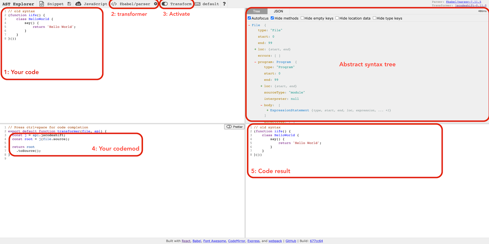

The SimpliField mobile application started in 2014.

At that time, AngularJS and Ionic were at the top 🕺. I decided to start with this stack but JavaScript **Modules system was not yet the norm.**

Two years ago (2018), I thought it was time to **migrate the code base to a new bright system of ES modules**. This migration was a good step forward to prepare the next code migrations (TypeScript, new framework...).

**The code contained ~600 files** with our old friend's `IIFE` function, an outdated syntax and without any modularization.

I knew that a manual modification creates the risk of introducing bugs.

## 🗺 The Plan

My plan to was to **migrate the codebase incrementally** by:

1. Updating the builder system to run ES module on some folders of the app.
2. Rewriting folders with `export` syntax.
3. `import`ing exported files in a root file.

I estimated at **4 months the time needed to migrate** the code base (in parallel with other projects). It seemed like a long and difficult road before being able to start the next improvements.

After 1 months of tedious work, I realized that the road could be longer than expected 😓.

## ✨ Codemod

And then, Codemod enter the game 🔥.

> _Codemod is a tool/library to assist you with large-scale codebase refactors that can be partially automated_ [[source]](https://github.com/facebook/codemod)

Codemod is parsing code source into an Abstract Syntax Tree (AST) which is the graph representation of the structure of source code. It provides a simple and comprehensive data structure to work with.

To help you understand code AST, there is a set of useful tools:

- [AST Explorer](https://astexplorer.net/): Your best friends for this mission. You can navigate, query and test the code.
- [EStree](https://github.com/estree/estree/blob/master/es5.md): Es tree syntax specification. It provides the documentation of nodes definition.
- [jscodeshift](https://github.com/facebook/jscodeshift): Run Codemod over multiple JavaScript or TypeScript files.

## 🕹 Let's play

I will present a simple example to help you dive in a use case.

But first, go on [AST Explorer](https://astexplorer.net/) to configure the editor:

1. Copy past the old syntax _in the upper left_
2. Select `@babel/parser` _in the header_ (next to JavaScript)
3. Activate `Transform` option _in the header_ with jscodeshift
4. Run and play with the code in the `transformer()` function _in the bottom left_.
5. Enjoy the result _in the bottom right_



Perfect, **you're now ready!** 🚀.

This is what we will expect from this example:

```jsx
// old syntax
;(function iife() {
  class HelloWorld {
    say() {
      return "Hello World"
    }
  }
})()
```

```jsx
// result
export class HelloWorld() {
    say() {
        return 'Hello World';
    }
}
```

We have to apply 2 transformations:

1. Remove IIFE wrapper
2. `export` the `HelloWorld` class

### 1. Remove IIFE wrapper

Let's remove the IIFE wrapper to keep only the class. This is what our transformer has to do:

1. Query the wrapper function
   - We will select all the `(function iife())` wrapper
   - First argument is the tree type we want: `j.ExpressionStatement`
   - Second argument is the node path selector (expression → callee → id → name) with the value `iife`.
   - It can be found thanks AST explorer. Just click on iife value _in the upper right_ and look at the path.
2. Replace node
   - Call Codeshift API with AST node to use helpers.
   - Replace the wrapper with his content (the class).

```jsx
const j = api.jscodeshift
const root = j(file.source)
// 1. Query AST
root
  .find(j.ExpressionStatement, {
    expression: { callee: { id: { name: "iife" } } },
  })
  // 2. Loop on AST nodes
  .forEach(ast => {
    // 3. Replace element
    j(ast).replaceWith(ast.node.expression.callee.body.body)
  })
```

> Copy past the code above in the `transformer()` function _in the bottom left_ and see the result _in the bottom right._

### 2. Add export

> 💡 Copy past the result of the step 1 in the upper left

Let’s now export the class.

1. Query the class element
   - First argument is the tree type we want: `j.ClassDeclaration`
   - Second argument: for this case, we don't need to query a specific class definition, so we can avoid it.
2. Loop on AST nodes: `.forEach()`
3. Define the new ES tree: `j.exportNamedDeclaration(content)`
   - 💡 Use AST explorer to know the definition of `export` AST node
   - 💡 Use EStree documentation to know the implementation
4. Replace with the new export definition
   - Call Codeshift API with AST node to use helpers2.
   - Replace the wrapper with his content → Remove `iife`

```jsx
// 1. Query AST
root
  .find(j.ClassDeclaration)
  // 2. Loop on AST nodes
  .forEach(ast => {
    // 3. Define the new ES tree
    const exportNode = j.exportNamedDeclaration(ast.node)
    // 4. Replace with the new export definition
    j(ast).replaceWith(exportNode)
  })
```

> Copy past the code above in the `transformer()` function after the code of step 1 and see the result*.*

**Et Voilà ! 🎉✨**

You now have your exported class without IIFE. And you can run it on all your affected files.

You can now take the first old code and run both transformation and see your new file.

**You can access to a full implementation here:**



## 👌 Conclusion

With Codemod, you can migrate easily any codebase to new code style with peace of mind.

You need to invest some time on the implementation, but it's totally worth it!

**It took me 1 week** to implement Codemod and migrate the SimpliField codebase

### Implementation ideas

You can do many things with Codemod to transform your code.

- Run your updated code style on all the code base.
- Split methods from a source file to create one file per method.
- Update your code to move to another framework.

### Some feedback regarding my experience playing with it:

- It is a bit challenging query AST at the beginning.
- Create helpers function to help you migrate the code. You can compose your helpers to migrate different files depends on the syntax.
- Keeping a style of code in a project helps you migrate files because they respect the same structure.
- Use `ast.forEach()` instead of `ast[0]`. It avoids adding a sanity check in case of the element doesn't exist in your tree.

Special thanks to [Quentin Tardivon](https://github.com/quentin-tardivon) and [Oleksandr Korneiko](https://medium.com/@oleksandr.k) for their help on this article.
